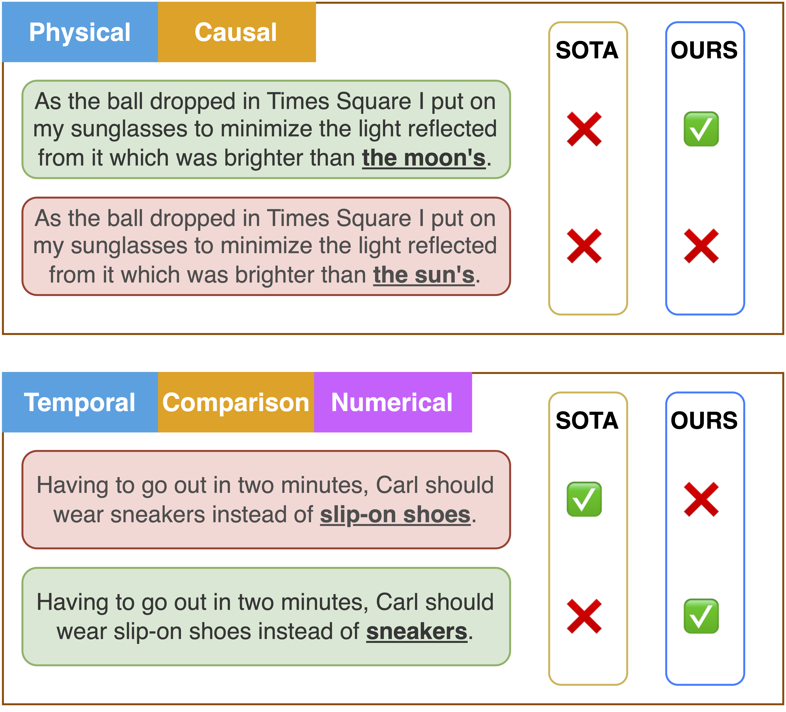

# Advancing Transformers’ Capabilities in Commonsense Reasoning

[](./LICENSE)
[](https://www.python.org/)


**Advancing Transformers’ Capabilities in Commonsense Reasoning [Technical Report](https://bryanzhou008.github.io/files/com2sense.pdf)**<br>
Yu Zhou, Yunqiu Han, Hanyu Zhou, Yulun Wu<br><br>

This repository includes code and scripts to run all experiments provided in the above technical report.


## Abstract
Recent advances in general purpose pre-trained language models have shown great potential
in commonsense reasoning. However, current works still perform poorly on standard commonsense reasoning benchmarks including the Com2Sense Dataset (Singh et al., 2021). We argue that this is due to a disconnect with current cutting-edge machine learning methods. In this work, we aim to bridge the gap by introducing current ML-based methods to improve general purpose pre-trained language models in the task of commonsense reasoning. Specifically, we experiment with and systematically evaluate methods including knowledge transfer, model ensemble, and introducing an additional pairwise contrastive objective. Our best model outperforms the strongest previous works by ∼ 15% absolute gains in Pairwise Accuracy and ∼ 8.7% absolute gains in Standard Accuracy.



## Reproduce Our Results

### Environment Setup

The training and testing code in this repo are runnable on a single Nvidia-V100 GPU. To install the required packages, simply run the following command:

```bash
# The below command will bulk install everything needed.
pip install -r requirements.txt
```

### Train

The following command will train our model on the Com2Sense Dataset Train Split.

```bash
sh scripts/train.sh
```


### Inference

The following command will run model inference on the Com2Sense Test Set

```bash
sh scripts/test.sh
```


## Citation

If you find the code in this repo helpful, please consider citing our technical report:

```
@article{Zhou2023CommonSense,
   title={dvancing Transformers’ Capabilities in Commonsense Reasoning},
   author={Zhou, Yu and Yunqiu, Han and Zhou, Hanyu, Wu and Yulun},
   year={2023},
}
```

## Acknowledgements

The code in this repository are written based on the [Com2Sense Paper Repo](https://github.com/PlusLabNLP/Com2Sense).

This project was completed during CS188-NLP, with support from the course instructors Ziyi Dou, Te-Lin Wu, and Prof. Nanyun Peng.
